# Capstone Project - Azure Machine Learning Engineer

# Table of Contents
1. [Overview]()
2. [Project Setup and Installation]()
3. [Dataset]()
4. [Azure ML Pipeline]()
5. [Hyperparameter Tuning]()
6. [Model Deployment]()
7. [Screen Recording]()
8. [Standout Suggestions]()
9. [Future Work]()

## Overview
This is a Capstone project in fulfilment of the Udacity Azure ML Nanodegree. This project is aimed at demonstrating the capabilities of the Azure ML studio in training a model and deploying it. There are two ways Azure ML studio achieves this: one is through AUTOML, a codeless configuration that automates machine learning. Another, is the HYPERDRIVE, a custom hyperparameter tuning functionality for optimizing a ML model's performance. Then, from any of these two functionalities of the Azure ML studio, a production model will emerge to enable us explore the Azure ML End-to-End production pipeline solution for enabling interaction between a deployed model and other web services.

**The Project Workflow**
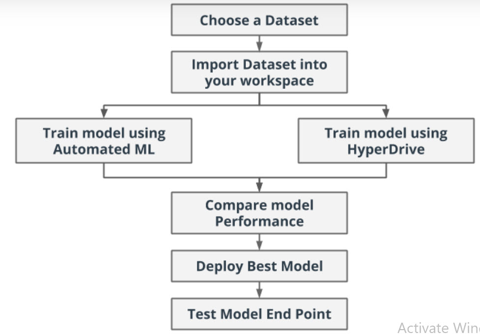

In this demo, the HYPERDRIVE tunned XGBOOST model emerged as the best performing model with an accuracy of 99.988% against a 99.978% accuracy for the AUTOML derived model. May it be noted that the AUTOML inspired the hyperdrive parameter optimization. Therefore, AUTOML proves to be a useful tool to guide ML model selection and parameter tunning for both experts and novice to save time training different models. 

## Project Set Up and Installation
If you are running your python codes in your own environment, follow [SDK installation instructions](https://docs.microsoft.com/en-us/azure/machine-learning/how-to-configure-environment). But if your experiments are run in Azure Notebooks and Azure managed environments, the SDK is already installed, which is the case of this experiment.
Also, ensure that all the required libraries are installed in your environment. For this experiment, we created a Docker based environment with the following packages installed:
1. Conda Packages
      -	scikit-learn
      -	numpy
      -	pandas

2. Pip Packages
      -	azureml-sdk 
      -	xgboost

## Dataset

### Overview
The data for use in this project is the Liver Disease dataset of over 30k patients available on Kaggle. Statistically, there has been an increasing number of patients with liver disease in recent time due to life style and living habits such as excessive alcohol consumption, inhale of harmful gases, excessive weight gain, intake of contaminated food, abuse of drugs. The Liver Disease dataset is aimed at alleviating the burden of analyzing every single patient’s data during clinical diagnoses of liver disease. 

### Task
The goal is to create a classifier that predicts whether a subject is healthy, non-liver disease patient, which will be classified as [2] or unhealthy, liver disease patient, which will be classified as [1] based on some standard clinical and demographic features which are: age, gender, total Bilirubin, direct Bilirubin, total proteins, albumin, A/G ratio, SGPT, SGOT and Alkphos. 
Attribute Information:
1.	Age Age of the patient
2.	Gender Gender of the patient
3.	TB Total Bilirubin
4.	DB Direct Bilirubin
5.	Alkphos Alkaline Phosphotase
6.	Sgpt Alamine Aminotransferase
7.	Sgot Aspartate Aminotransferase
8.	TP Total Protiens
9.	ALB Albumin
10.	A/G Ratio Albumin and Globulin Ratio
11.	Selector field used to split the data into two sets (labeled by the experts) 1 Liver Patient, 2 non-Liver Patient

### Access
The liver disease dataset can be found at the [link](https://www.kaggle.com/abhi8923shriv/liver-disease-patient-dataset/notebooks). 
The liver disease dataset comprises of the [train data]( "https://raw.githubusercontent.com/chollette/nd00333-capstone/master/Liver%20Patient%20Dataset%20(LPD)_train.csv") and the [test data]( "https://raw.githubusercontent.com/chollette/nd00333-capstone/master/test.csv"). To be able to access these data in the notebook, they are downloaded and stored in the datastore to connect the data to this experiment workspace to enable easy sharing with others, reuse across various experiments, and easy access by name in the training script.

# The Azure ML Pipelines
## Automated Machine Learning (AUTOML) 
An AutoML is built on the Liver Disease dataset to automatically train and tune machine learning algorithms at various hyperparameter tuning and feature selection for an optimal selection of a model that best fits the training dataset using a given target metric. The pipeline is diagrammatically provided below.

**AUTOML Pipeline**

The AUTOML configurations used in setting-up the runs is provided in the below given image.

**AUTOML Configuration**
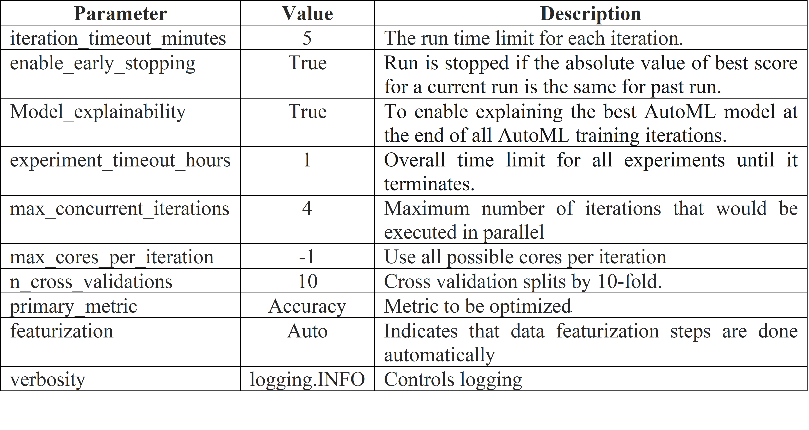

### Results
The AutoML pipeline is observed to have produced models with very good performance accuracies. We observe particularly the top five (5) performing models, which are:
1. Voting Ensemble
2. Stack Ensemble
3. LightGBM with MaxAbsScaler preprocessing technique 
4. LightGBM with MaxAbsScaler preprocessing technique (tweaked), and 
5. XGBoostClassifier with MaxAbsScaler preprocessing technique

From experiments, the *n_cross_validations* and *experiment_timeout_hours* were two automl configuration settings that contributed to the high accuracy of the automl run. The top-most performing model of the AUTOML run is the Voting Ensemble with an accuracy of 99.978% achieved from the ensemble of LightGBMClassifier and LogisticRegression Classifier. The AUTOML used the default values of the LightGBMClassifier and tuned the parameters of the LogisticRegression classifier; they are:

**LightGBMClassifier Parameters**
  - boosting_type = 'gbdt':  traditional Gradient Boosting Decision Tree. 
  - max_depth = -1: Maximum tree depth for base learners, <=0 means no limit.
  - learning_rate = 0.1: Boosting learning rate
  - min_child_samples = 20: Minimum number of data needed in a child (leaf).
  - min_child_weight =0.001: Minimum sum of instance weight (hessian) needed in a child (leaf).
  - colsample_bytree = 1.: Subsample ratio of columns when constructing each tree.

**LogisticRegression Classifier Parameters**
  - C = 1526.4179671752302: Regularization strength; smaller values specify stronger regularization.
  - max-iter = 100: Maximum number of iterations taken for the solvers to converge.
  
Provided as images are automl run *experiments*, visualized using Run Details Widget, the retrieved automl run *Best Model ID and parameters* and the Registered Model to workspace. 

**RunDetails widget to show the different experiments**
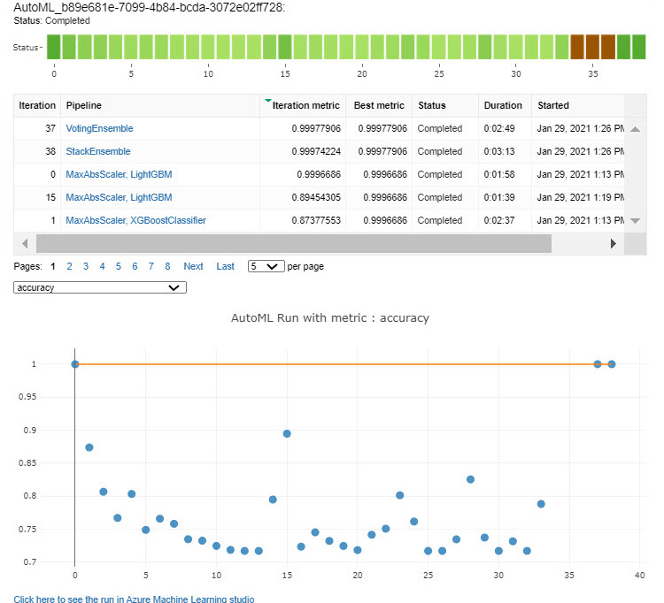

**Best Model ID and Parameters**
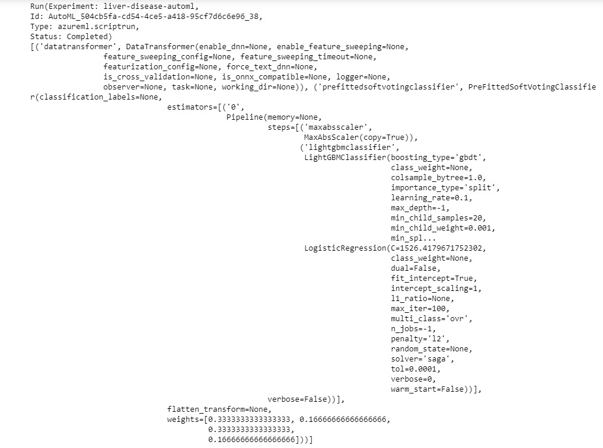

**Registered Model to Workspace**
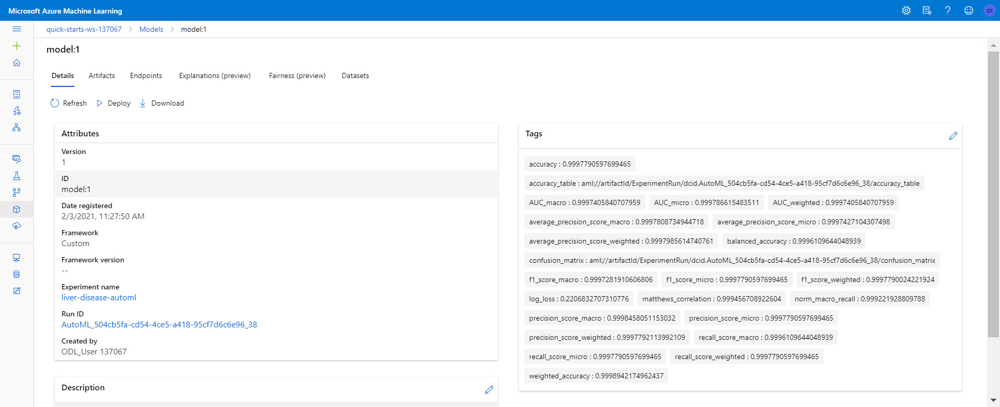

## Hyperparameter Tuning
In this project, the Azure ML python SDK services is employed to train a model on the Liver Disease dataset on a four-node CPU through employing the capabilities of the Azure ML HyperDrive for tunning a model’s hyperparameters in order to optimize its performance. 

For this project, we tuned the hyperparameters of the 5th runner-up of the *best performing model of the AUTOML*, which is the XGBOOST model with a performance of 87.378% accuracy to observe how tuning the XGBOOST hyperparameters while using the best values of other parameters as determined by AUTOML. The HyperDrive pipeline is illustrated as follows.

**HYPERDRIVE Pipeline**

### HyperDrive Setup
Considering that the HyperDrive requires a search space for tuning the hyperparameters, this project adopted the Random Sampling search space with the intention to randomly sample hyperparameter values from a defined search space without incurring computational cost. This search space supports hyperparameter values provided as discrete or continuous values; but this project search space is set to discrete because it achieved the best accuracies compared to the accuracies obtained of the model when the continuous search space was used. The tuned hyperparameters can be viewed  and are described as follows:
  - n_estimators: Number of trees you want the algorithm to build. The more rows in the data, the more trees are needed. So, the following values are ranges tuned for             number of trees: [10, 50, 100, 500, 1000, 5000].
  - max_depth: Controls how specialized each tree is to the training dataset. The more the value the more likely overfitting. So, the following values are ranges tuned for       the maximum depth of the tree: [3, 4, 5, 6, 7, 8, 9, 10].
  - Subsample: Randomly selected subset of the training dataset to fit each tree. Fewer samples cause more variance for each tree. So, the following values are ranges             tuned for the subset of the training data to fit to the tree: [0.5,0.6,0.7,0.8,0.9,1].

Further, the Random Search space supports early termination of low-performing models. To apply the early stopping policy, this project adopted the “Bandit Termination Policy” to ensure that the Azure ML pipeline does not waste time exploring runs with hyperparameters that are not promising. The policy is expressed as:

T =  Metric/((1+S) )                           *where T is the termination threshold,S,the slack-factor.*

A run terminates when metric < T.

### Results
From experiments, tuning the hyperparameters resulted in *n_estimators = 1000*, *max-depth = 5*, and *Subsample = 0.8* which contributed to the high accuracy value of 99.988% accuracy of the XGBOOST model. Performance can visualized in the provided images.

**The RunDetails Widget View of the XGBOOST HypyerDrive Run**
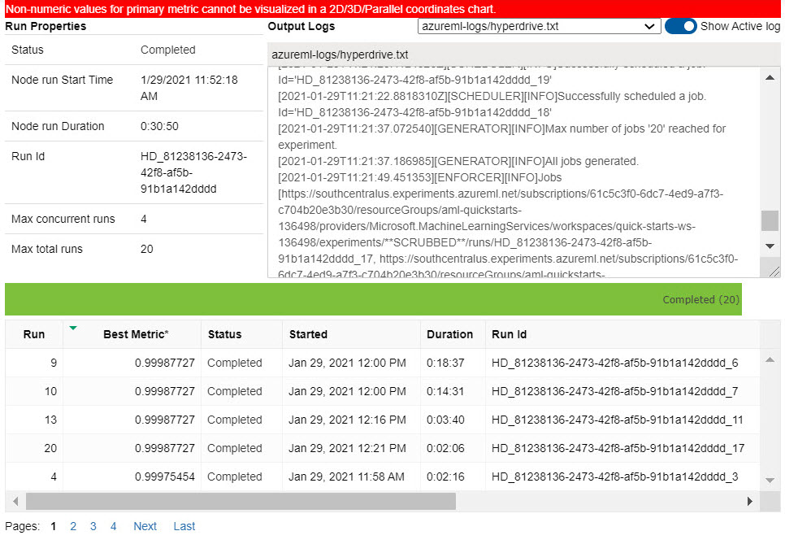

**Graphical Plot of the XGBOOST HypyerDrive Run** 
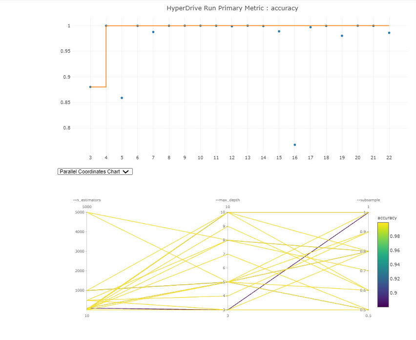

**Best Run ID**
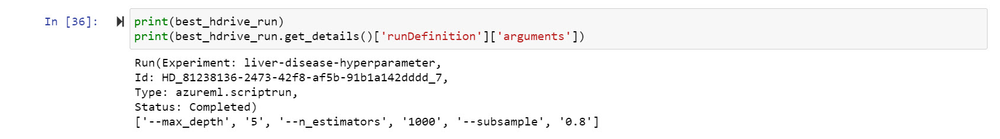

As can be seen, it resulted in a 12.61% performance improvement to the XGBOOST model retrieved by the AUTOML and a 0.00982% deference in comparison to the AUTOML best performing model, the VotingEnsemble model. If there could be a better model, maybe that can be achieved through standardizing the dataset prior to hyperparameter tuning the XGBOOST model, but i doubt this because xgboost, just like randomforest, is mostly insensitive to data normalization and it might affect performance accuracy. 

## Model Deployment
A deployed model interacts with a production environment via HTTP API service in order to receive input via a POST request and return the model’s predicted output. To deploy the best model:

1. Create a container image in Azure to install all the environment needed by the model to run as a webservice. 
2. Consume Model Endpoints by passing a Python script, score.py, that includes code to predict the test values of an inbound data point.
3. Setup the deployment configuration. In our case, we used the Azure Container Instance webservice to create the deployed model endpoint, which is a HTTP endpoint with a REST API that allows you to send data and receive the prediction returned by the model. Once the model has been deployed and succeeded, the status is changed to healthy. For a view of our deployed model status, it can be viewed on the Azure Python SDK or via the Azure ML Studio as can be seen in the below given images, respectively.

**Deployed Model Status via Azure Python SDK**
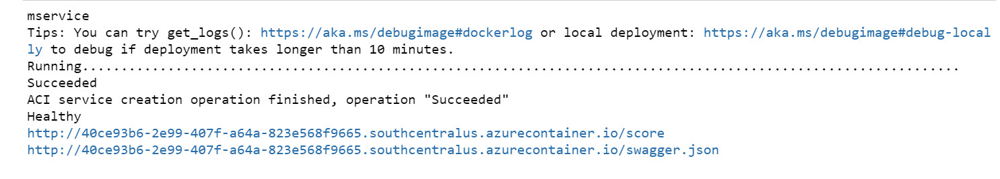

**Deployed Model Status via Azure ML Studio**
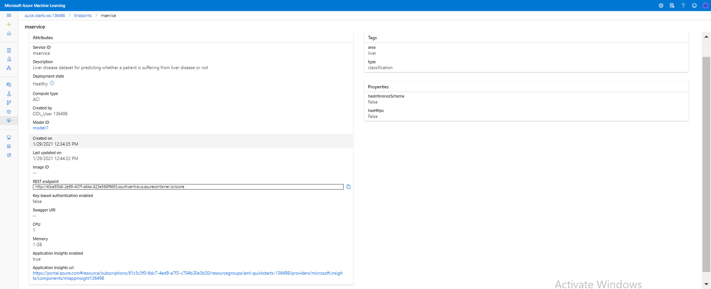

4. Test the deployed model. We passed a JSON data of two data points to the ACI web service to get prediction values for two liver disease patients. The JSON file must be an array of rows of data where each row should either be an array of values appearing in the order it appears in the training set. 

The test sample JSON data is given as follows:
'{"data": [[66.0, 1.0, 0.0, 0.9, 0.2, 210.0, 35.0, 32.0, 8.0, 3.9], [50.0, 0.0, 1.0, 9.4, 5.2, 268.0, 21.0, 63.0, 6.4, 2.8]]}'

## Screen Recording
For a demonstration of the capabilities of Azure ML python SDK in developing End-to-End ML production model, click the provided link to a screencast recording of the project. 

## Standout Suggestions
Only one standout suggestion was made because I deployed XGBOOST model which does not permit the creation of an ONNX model and so only logging was attempted. 

 - Model Logging: The logging feature of the Azure diagnostic tool, which logs anomalies and errors, makes debugging a web service application easy. The performance logs can be visualized by enabling “Application Insights” in the deployment configuration settings and through calling a logging function *logging.basicConfig(level=logging.DEBUG)* within the score.py script. For the deployed model, its logs are given in the below image.
 
 **Deployed Model Logs**
 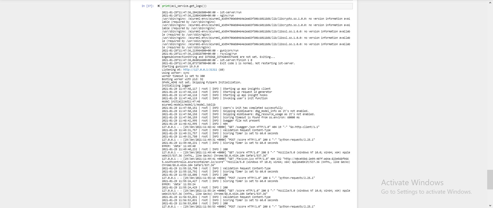
 

## Future Work
The following are possible improvements to this project that will enable us to explore the numerous functionalities of the Azure ML Studio. They are:

  - Tune the hyperparameters of the AUTOML best running model, the VotingEnsemble model. 
  - Deploy the overall project best running model to a device running Azure IoT Edge by exploring the IoT Edge module. 
  - Adopt the Azure monitoring data for extensively analysing training data in real-time as it grows from external sources.

